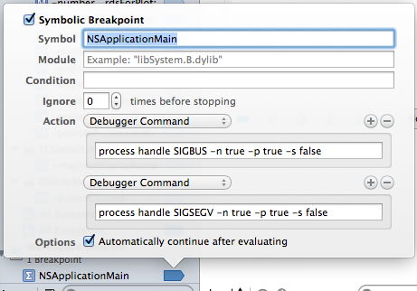

EmbeddedJvm Framework
=====================

How to Use
----------

1. Add EmbeddedJvm to your Podfile:
    
    pod 'EmbeddedJvm', :git => 'https://github.com/esorf/EmbeddedJvm.git'

2. Add script step to copy JRE to application PlugIns folder.
    1. Editor > Add Build Phase > Add Run Script Build Phase
    2. Specify the 'CopyJavaToPluginsFolder.sh' script with parameter pointing
       to the JRE or JDK you would like to embed. The path will look like 
       "/Library/Java/JavaVirtualMachines/jre1.7.0_51.jre".
    3. Add Input Files to the script step specifying paths of individual jar files
       and collections of .jar files you would like copied to the app/Contents/Java 
       folder. Every .jar file in that folder will be included automatically in the
       classpath.

3. Add a key to the app's main bundle (Info.plist) called "JVMRuntime" with the name
   of the JRE or JDK, like "jre1.7.0_51.jre". (In the future, we will eliminate this step by
   scanning the Plugins folder for things that look like JREs.)

(If anyone knows how to add the script step within the podspec, lemme know!  You'd still have 
to manually add parameters, but it would be nice to give the pod user a helpful start.)

The JVM loading code looks for properties in the applications bundle info dictionary (Info.plist).
- JVMRuntime - Example: jre1.7.0_51.jre
- JVMOptions - Example:
    - -XX:MaxPermSize=256m
    - -Xms200m
    - -Xmx1500m

Tips
----

- Debugging Objective-C: When hosting a JVM under LLDB, the debugger will stop every time a SIGSEGV or SIGBUS signal is thrown, which is many times. Oddly, the JVM option '-Xrs' (reduce signal use) was NOT effective here. Two options to enable debugging without constant interruption are:
    1. Add a Symbolic Breakpoint that configures the debugger to ignore the signals. ([Thanks, puzzle on stackoverflow.](http://stackoverflow.com/a/10456557/1207583))
        
    2. Disable JIT compilation with -Djava.compiler=NONE
- Use the -Xcheck:jni and -verbose:jni options while working out JNI issues
- Use -Xmanagement:port=7091,ssl=false,authenticate=false,autodiscovery=true to easily
  connect to Java Mission Control for advanced JVM monitoring. Tighten up security options (ssl, authenticate) as necessary.
  Make sure to turn the App Sandbox OFF in order to debug with the Java Mission Control. (I tried enabling "incoming network" capability instead but was not able to use Java Mission Control without getting out of the sandbox.)

Code Sample
-----------

``` objc
    // Sample static function called from JVM
    JNIEXPORT jbyteArray staticFn(JNIEnv *env, jclass clazz, jbyteArray bytes) {
        return bytes; // Example
    }
    // Sample object function call from JVM
    JNIEXPORT void objectFn(JNIEnv *env, jobject obj, jstring label, jint count) {
        return;
    }
    static JNINativeMethod method_table[] = {
        // EJ_JVM_NATIVE macro streamlines what would otherwise look like:
        // { const_cast<char *>("bytesFromJvm"), const_cast<char *>("([B)[B"), (void *) bytesFromJvm }
        EJ_JVM_NATIVE("staticFn", "([B)[B", staticFn),
        EJ_JVM_NATIVE("objectFn", "(Ljava/lang/String;I)V", objectFn),
    };

    NSError *error = nil;
    // Often no need to pass classpaths because default is generated from jars in app/Contents/Java
    // Options are read from JVMOptions in the Info.plist but additional ones may be passed as an array here
    EmbeddedJvm *jvm = [[EmbeddedJvm alloc] initWithClassPaths:nil options:nil error:&error];
    if (jvm==nil) {
        ... error handling ...
    }
    ...
    [jvm doWithJvmThread:^(JNIEnv *env) {
        // block runs on attached JVM thread with valid env ...
        NSError *error = nil;
        EJClass *cls = [[EJClass alloc] initWithClassName:@"com/mycompany/myproject/MyClassName" env:env error:&error];
        if (cls==nil) {
            ... error handling ...
            return;
        }

        [cls printMethods:env]; // Utility method - prints out all public methods of class with signature
            
        jmethodId bytesInAndOut = [cls getObjectMethod:@"bytesToJvm" signature:@"([B)[B" env:env error:&error];
        if (bytesInAndOut==nil) {
            ... error handling ...
            return;
        }
        BOOL success = [cls registerNativeMethods:method_table count:2 env:env error:&error];
        if (!success) {
            ... error handling ...
            return;
        }
        jobject obj = [cls createObject:env error:&error];
        if (obj==nil) {
            ... error handling ...
            return;
        }
        // This example using an array of bytes for both input and output.
        // Of course the env->Call*Method set of methods support other data types, too.
        NSData *data = ... // input data
        jbyteArray bytes = EJDataToJBytes(data, env); // Utility function
        jbyteArray out = (jbyteArray)env->CallObjectMethod(obj, bytesInAndOut, bytes);
        NSData *outData = EJJBytesToData(response, env);
        
        ... Use standard methods like dispatch or notifications to send outData on its way ...
    }];
```

Copyright (c) 2014 Futurose
